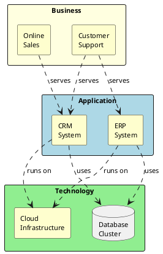

> **Hermes Usage:** Load with `skill_view(name="mv-archimate")`. Output ArchiMate diagrams as PlantUML code blocks.

# ArchiMate Enterprise Architecture

**Quick Start:** Identify TOGAF layer → Select ArchiMate elements → Define relationships → Apply motivation/strategy extensions → Wrap in ` ```plantuml ` fence.

## Core Layers

| Layer | Color | Elements |
|-------|-------|----------|
| Motivation | Purple | Stakeholder, Driver, Assessment, Goal, Principle, Requirement |
| Strategy | Gold | Capability, Resource, Course of Action |
| Business | Yellow | Business Actor, Role, Process, Function, Service, Product |
| Application | Blue | Application Component, Service, Interface, Data Object |
| Technology | Green | Node, Device, System Software, Network, Path |
| Physical | Brown | Equipment, Facility, Material |
| Implementation | Grey | Work Package, Deliverable, Plateau, Gap |

## Example: Layered View



## Relationship Types

| Symbol | Meaning |
|--------|---------|
| `-->` | Composition |
| `..>` | Realization |
| `-->>` | Serving |
| `..>>` | Access |
| `->>` | Triggering |
| `..\|>` | Specialization |
| `--\|>` | Assignment |

## Common Pitfalls

| Issue | Solution |
|-------|----------|
| Mixed layers | Keep each layer in separate rectangle |
| Too many elements | Limit to 10-15 per diagram |