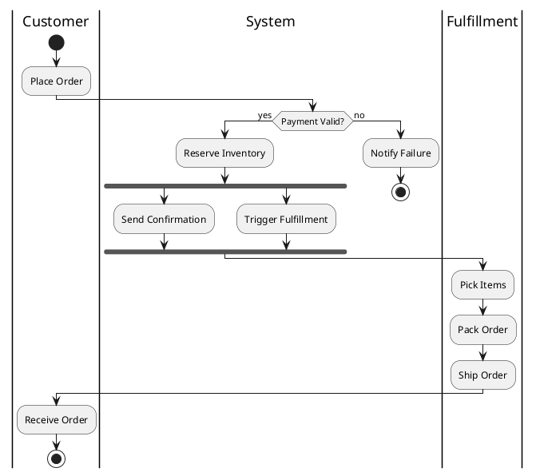

> **Hermes Usage:** Load with `skill_view(name="mv-bpmn")`. Output BPMN diagrams as PlantUML code blocks.

# BPMN Diagram Generator

**Quick Start:** Map process flow → Identify participants and lanes → Place BPMN elements (task, gateway, event) → Connect with sequence flows → Wrap in ` ```plantuml ` fence.

## BPMN Element Types

| Element | Syntax | Purpose |
|---------|--------|---------|
| Task | `:Task Name;` | Unit of work |
| User Task | `:User Task;` with `<<user>>` stereotype | Human interaction |
| Service Task | `:Service Task;` with `<<service>>` stereotype | Automated service |
| Exclusive Gateway | `if (condition?) then (yes)` | XOR decision |
| Parallel Gateway | `fork` / `fork again` / `end fork` | AND split/join |
| Start Event | `start` | Process trigger |
| End Event | `end` / `stop` | Process completion |
| Timer Event | `@startuml` with timer shapes | Scheduled/delayed |
| Message Event | Message envelope shapes | Message-based flow |

## Example: Order Processing



## Enterprise Integration Patterns (EIP)

Use `mxgraph.eip.*` stencils:
- `mxgraph.eip.message_channel` — Message Channel
- `mxgraph.eip.message_router` — Content-Based Router
- `mxgraph.eip.message_translator` — Message Translator
- `mxgraph.eip.aggregator` — Aggregator
- `mxgraph.eip.splitter` — Splitter

## Common Pitfalls

| Issue | Solution |
|-------|----------|
| Missing gateway merge | Always close splits with matching join |
| Swimlane confusion | Keep roles consistent across diagram |
| Over-nested gateways | Flatten to max 2 levels |