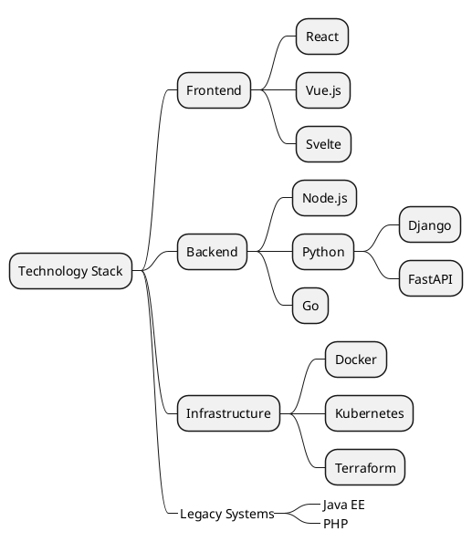
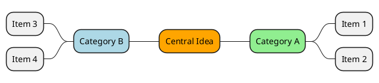

> **Hermes Usage:** Load with `skill_view(name="mv-mindmap")`. Output mind maps as PlantUML `@startmindmap` code blocks.

# Mind Map Generator

**Quick Start:** Define central topic → Add branches with `*` (right) or `*_` (left) → Nest sub-branches with additional `*` → Apply colors and formatting → Wrap in ` ```plantuml ` fence.

## Syntax Quick Reference

| Symbol | Direction | Example |
|--------|-----------|---------|
| `*` | Right side (default) | `* Branch A` |
| `*_` | Left side | `*_ Branch B` |
| `**` | Sub-branch right | `** Sub-topic` |
| `**_` | Sub-branch left | `**_ Sub-topic` |
| `***` | Deep sub-branch | `*** Detail` |

## Formatting

```
* <size:20><b>Bold Title</b></size>
* <color:red>Red branch</color>
* <s>Strikethrough</s>
* :emoji: Text
* <&icon-name> Text with icon
```

## Example: Technology Stack Mind Map



## Directional Control



## Common Pitfalls

| Issue | Solution |
|-------|----------|
| One-sided map | Mix `*` and `*_` for balanced layout |
| Deep nesting unreadable | Max 4-5 levels |
| Colors not showing | Use hex codes: `*[#FF6600]` |