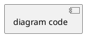

> **Hermes Usage:** Load with `skill_view(name="mv-uml")`. Output diagrams as Markdown code blocks.

# UML Diagram Generator
**Quick Start:** Choose diagram type → Write PlantUML text → Define elements and relationships → Wrap in ` ```plantuml ` fence.
> ⚠️ **IMPORTANT:** Always use ` ```plantuml ` or ` ```puml ` code fence. NEVER use ` ```text ` — it will NOT render as a diagram.

## Critical Rules

- Every diagram starts with `@startuml` and ends with `@enduml`
- Use standard PlantUML keywords: `class`, `interface`, `abstract`, `enum`, `actor`, `participant`, `component`, `node`, `database`, `package`
- Relationships use arrow syntax: `-->`, `<|--`, `*--`, `o--`, `..>`, `..|>`
- Use `skinparam` for global styling and colors
- Use `#color` on individual elements for specific colors
- Notes use `note left of`, `note right of`, `note over`, or standalone `note "text" as N`

## UML Diagram Types
| Type | Purpose | Key Syntax | Example |
|------|---------|------------|---------|
| Class | Class structure and relationships | `class`, `interface`, `<\|--` | class-diagram |
| Sequence | Message interactions over time | `participant`, `->`, `-->` | sequence-diagram |
| Activity | Workflow and process flow | `start`, `:action;`, `if/else` | activity-diagram |
| Swimlane Activity | Multi-role activity with swimlanes | `\|Lane\|`, `:action;` | swimlane-activity-diagram |
| State Machine | Object lifecycle states | `state`, `[*] -->` | state-machine-diagram |
| Component | System component organization | `component`, `[name]`, `interface` | component-diagram |
| Use Case | User-system interactions | `actor`, `usecase`, `(name)` | use-case-diagram |
| Deployment | Physical deployment architecture | `node`, `artifact`, `database` | deployment-diagram |
| Object | Runtime object snapshot | `object "name" as id` | object-diagram |
| Package | Module organization | `package "name"` | package-diagram |
| Communication | Object collaboration | Numbered messages with sequence syntax | communication-diagram |
| Composite Structure | Internal class structure | `component` with nested `port` | composite-structure-diagram |
| Interaction Overview | Activity + sequence combination | `group`, `ref over` | interaction-overview-diagram |
| Profile | UML extension mechanisms | `<<stereotype>>` labels | profile-diagram |

## Mxgraph Stencil Icons

Supports 9500+ mxgraph stencil icons (AWS, Azure, Cisco, Kubernetes, etc.) via the `mxgraph.*` syntax.

### Syntax

```
mxgraph.<namespace>.<icon> "Label" as <alias>
mxgraph.<namespace>.<icon> "Label" as <alias> #color
mxgraph.<namespace>.<icon> <alias>
```

### Examples

```plantuml
@startuml
' Simple icon declaration
mxgraph.aws4.lambda "Lambda\nFunction" as fn
mxgraph.aws4.api_gateway "API GW" as gw
mxgraph.aws4.dynamodb "DynamoDB" as db

gw --> fn
fn --> db
@enduml
```

```plantuml
@startuml
' Kubernetes architecture with icons
mxgraph.kubernetes.ing "Ingress" as ing
mxgraph.kubernetes.svc "Service" as svc
mxgraph.kubernetes.pod "Pod" as pod
mxgraph.kubernetes.deploy "Deployment" as deploy

ing --> svc
svc --> pod
pod --> deploy
@enduml
```

## Output Format

````markdown

````